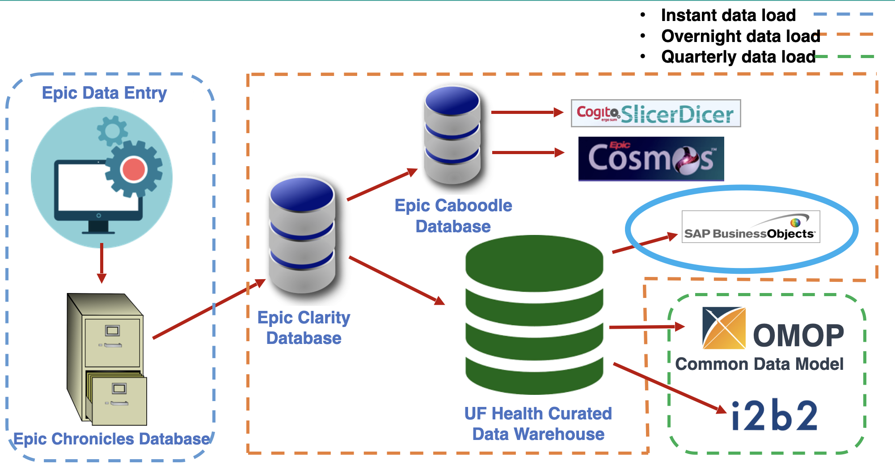

## Representation of Clinical Data

- Digital version of a patient’s medical data and history
- Maintained overtime by a healthcare provider
- Stakeholders: Patients and healthcare providers such as physicians,
  nurses, billing team, …

:::::::: columns
::::::: center
:::: {.column width="60%"}
::: {style="font-size: 80%;"}
**Structured Data Elements**

- Diagnoses
- Procedures
- Medications
- Laboratory results
- Vital signs
:::
::::

:::: {.column width="40%"}
::: {style="font-size: 75%;"}
**Unstructured Data Elements**

- Clinical Notes
- Imaging Order Reports
- Pathology Reports
- Patient Portal Messages
:::
::::
:::::::
::::::::

## Electronic Health Records (EHR)

:::::::: columns
::::::: center
:::: {.column width="50%"}
::: {style="font-size: 80%;"}

{.lightbox
.r-stretch group="my-gallery" width="98%" height="auto"}

:::
::::

:::: {.column width="50%"}
::: {style="font-size: 75%;"}

{.lightbox
.r-stretch group="my-gallery" width="100%" height="200%"}

:::
::::
:::::::
::::::::

------------------------------------------------------------------------

## Clinical Data Warehouse/ Repository

::: {.callout-tip collapse="true" title="Why?" appearance="minimal"}
- EHR is designed to support clinical care and workflows, not
  necessarily research

- EHR data is comprised of data from multiple sources and is not readily
  usable for downstream analysis, which gives rise to the need for a
  clinical data warehouse or repository
:::

- Clinical Data Warehouse (CDW) is a database that consolidates data
  from a variety of clinical sources to present a unified view of a
  single patient

- It is optimized for record retrieval and reporting, which can be used
  for research, quality improvement, and operational purposes

- Typically, CDWs include but are not limited to data elements like
  patient demographics, diagnoses, procedures, medications, laboratory
  results, and vital signs

------------------------------------------------------------------------

## UF Health Integrated Data Repository (IDR)

- Large-scale clinical data warehouse (CDW)
- UF Health data \~4 million patients
- Developed over decades by Shands and UF Health decision support
  services/IT analytics, and CTSI
- Supports both Epic-generated and non-Epic generated data
- Supports clinical, operational, and research missions

------------------------------------------------------------------------

## IDR Data Lineage

{.lightbox
.r-stretch group="my-gallery-2" width="98%" height="auto"}

------------------------------------------------------------------------

## Data Modalities curated by IDR Research Data Services

- Structured Data
- Clinical Notes
- Radiology Images and Reports
- Pathology Reports
- MyChart Patient Portal Data
- Social Determinants of Health data from EPIC
- Genomic Module

------------------------------------------------------------------------

## Key IDR Research Data Services Initiatives

::: {style="font-size: 65%;"}
- Self-Service Tools for Cohort Discovery and Data Extraction

  - UF Health i2b2
  - OneFlorida+ i2b2
  - OHDSI ATLAS

- Data Standardization and Harmonization with Common Data Models

  - OMOP Common Data Model
  - PCORnet
  - i2b2

- Multimodal Data Curation for research

- Digital Twin - deploying computable phenotypes and establishing
  loyalty cohorts

- Collaboration with research teams

  - UF Clinical and Translational Science Institute (CTSI)
  - UF Health Cancer Institute
  - Intelligent Clinical Center Center (IC3)
  - OneFlorida+ Clinical Research Consortium
  - College of Dentistry
:::

------------------------------------------------------------------------

## Contact IDR Research Data Services

<iframe src="https://idr.ufhealth.org" width="100%" height="50%" style="border:1px solid #f67505;">

</iframe>

::: {style="font-size: 60%;"}

[UF Health IDR](https://idr.ufhealth.org)

:::

Email IDR at
[**IRBDataRequest\@ahc.ufl.edu**](mailto:IRBDataRequest@ahc.ufl.edu) for
any questions or concerns